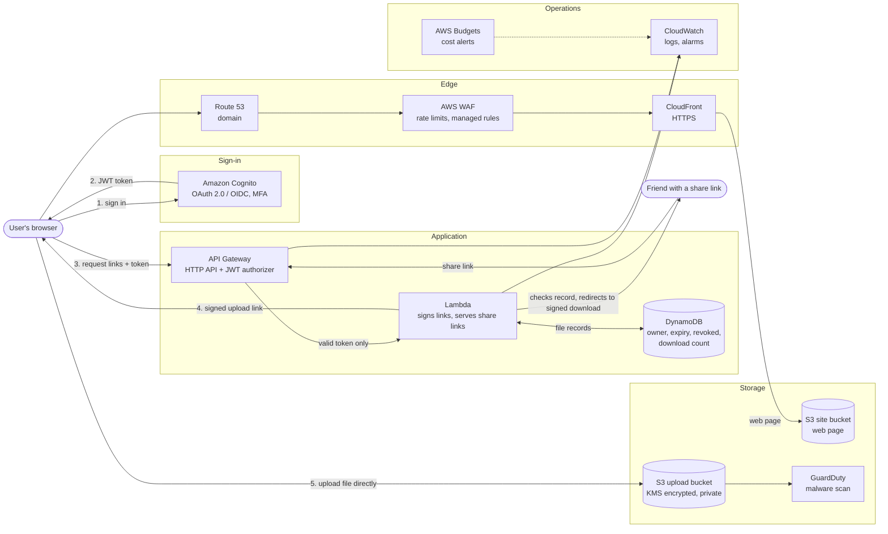
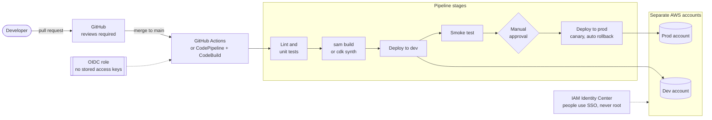

# Production architecture (diagram for slides)

## Runtime

## Delivery pipeline

## What each part fixes compared with the demo

| Demo | Production |
|---|---|
| Anyone can call the Function URL | API Gateway + Cognito: only signed-in users reach the Lambda |
| No record of files | DynamoDB: owner, revoke a link, limit downloads |
| `*.lambda-url...` and `*.cloudfront.net` addresses | Route 53 domain with HTTPS |
| No abuse protection | WAF rate limits and managed rules |
| Click-through console deploys | Pipeline, infrastructure as code, dev and prod kept apart |
| Long-lived access keys on a laptop | OIDC and SSO, temporary credentials only |
